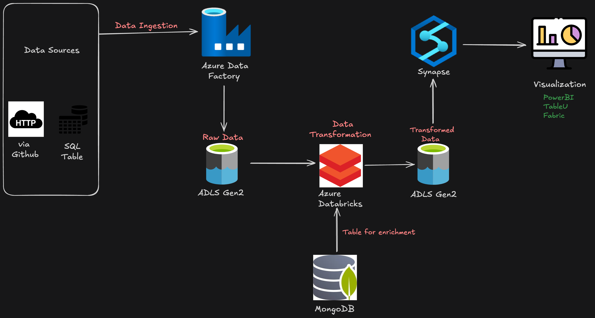

# EvecT ---:) 🚀 Big Data Pipeline on Azure  

This project demonstrates a **modern end-to-end Big Data Pipeline** using **Microsoft Azure**, capable of ingesting diverse datasets from multiple sources, transforming them at scale, and enabling advanced analytics through BI tools.  

## 🔹 Architecture Overview  
1. **Data Ingestion**:  
   - Orchestrated using **Azure Data Factory** to collect structured, semi-structured, and unstructured data from multiple sources.  

2. **Data Storage**:  
   - Raw data stored in **Azure Data Lake Storage (ADLS)** for durability, scalability, and governance.  

3. **Data Transformation**:  
   - Cleaned and transformed in **Azure Databricks (PySpark)** to prepare high-quality datasets.  

4. **Data Enrichment**:  
   - Processed data integrated with **MongoDB (NoSQL)** for fast, flexible, and scalable enrichment.  

5. **Data Warehouse & Analytics**:  
   - Modeled data loaded into **Azure Synapse Analytics** for enterprise-grade querying and analysis.  

6. **Visualization**:  
   - Connected to **Power BI** and **Tableau** for building dashboards and enabling insights for data scientists and analysts.  

## 🔹 Tech Stack  
- **Cloud Services**: Azure Data Factory, Azure Data Lake Storage, Azure Databricks, Azure Synapse Analytics  
- **Database**: MongoDB (NoSQL)  
- **Visualization Tools**: Power BI, Tableau  
- **Languages/Frameworks**: PySpark, Python, SQL  

## 🔹 Impact  
- Automated and scalable data ingestion from heterogeneous sources  
- Centralized, governed storage for raw and curated datasets  
- Optimized transformations and enrichment for advanced analytics  
- Seamless integration with BI tools for **interactive dashboards and data-driven decisions**  
